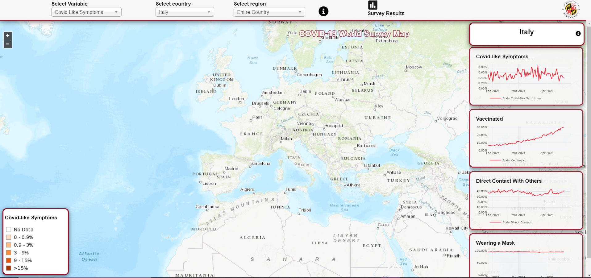

  

COVID-19 World Symptoms Survey is a partnership between Facebook and academic institutions. The survey is available in 56 languages. A representative sample of Facebook users is invited on a daily basis to report on topics including, for example, symptoms, social distancing behavior, vaccine acceptance, mental health issues, and financial constraints. Facebook provides weights to reduce nonresponse and coverage bias. Country and region-level statistics are published daily via public API and dashboards, and microdata is available for researchers via data use agreements. Over half a million responses are collected daily.

