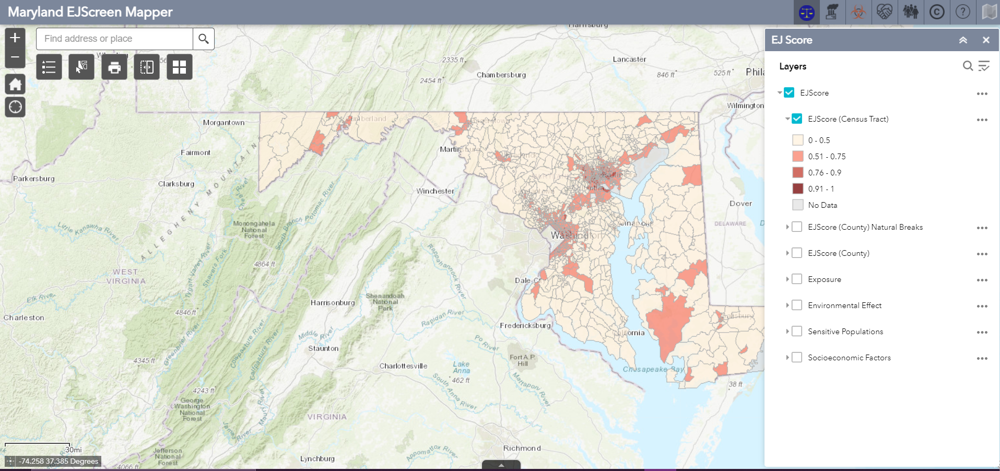

I created web application for visualizing environmental justice, park equity, and climate and health data at the census tract and block group levels. This involved analyzing and preparing dozens of data layers and creating custom Web AppBuilder tools in Javascript.

https://p1.cgis.umd.edu/mdejscreen/

https://p1.cgis.umd.edu/mdparkequity/

https://p1.cgis.umd.edu/mdclimateequity/

